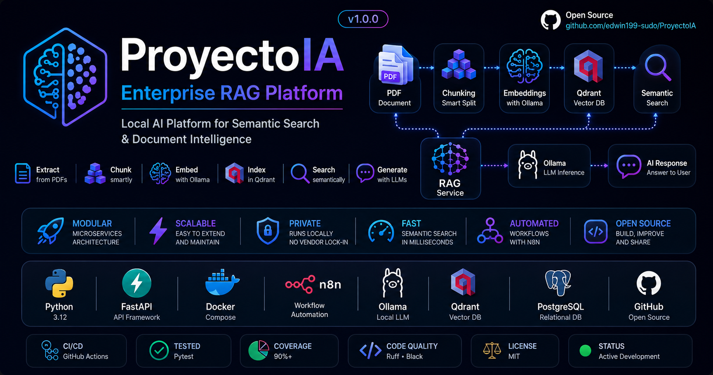
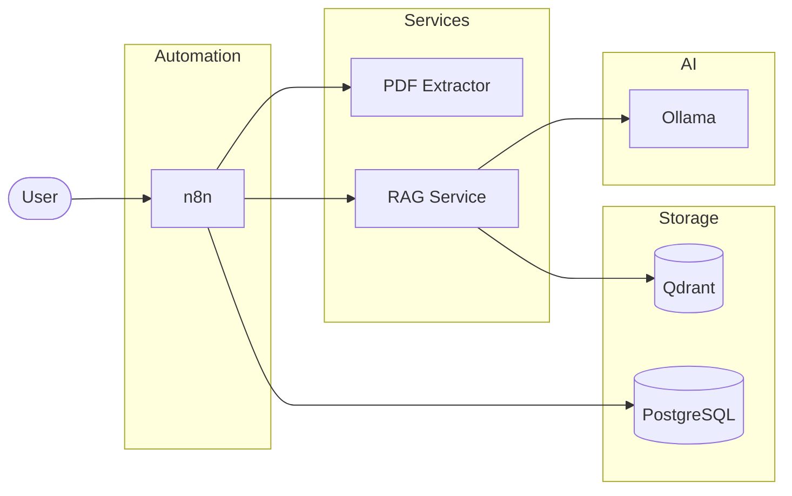
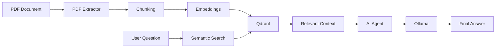
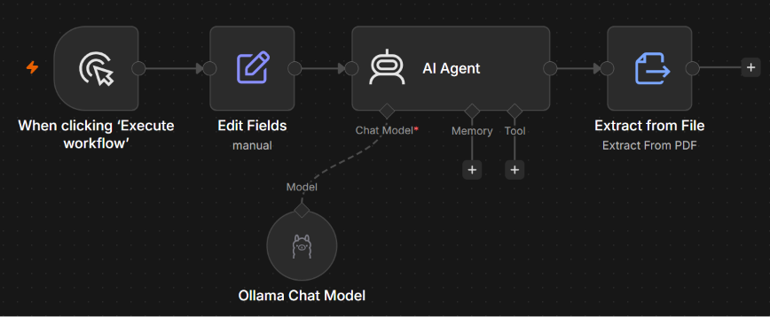
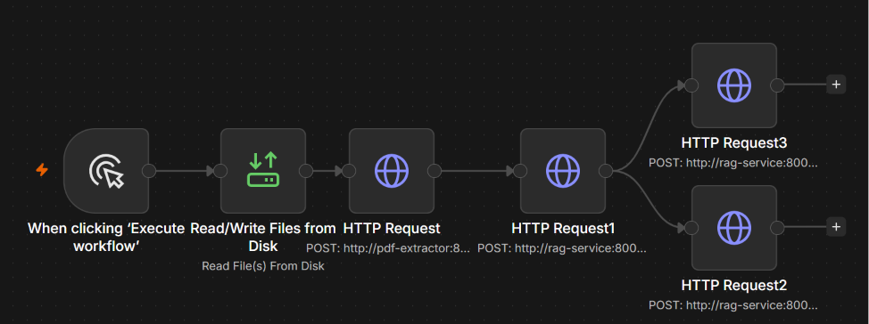
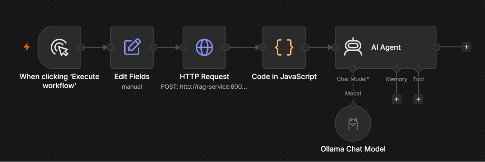
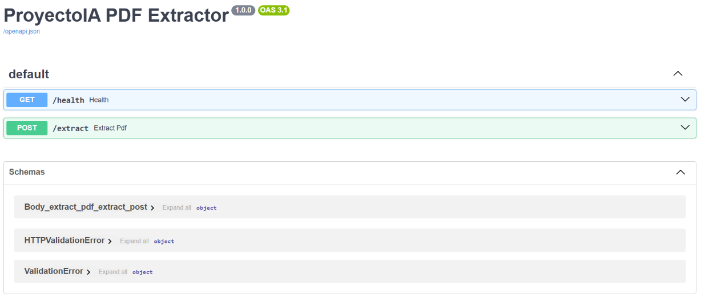
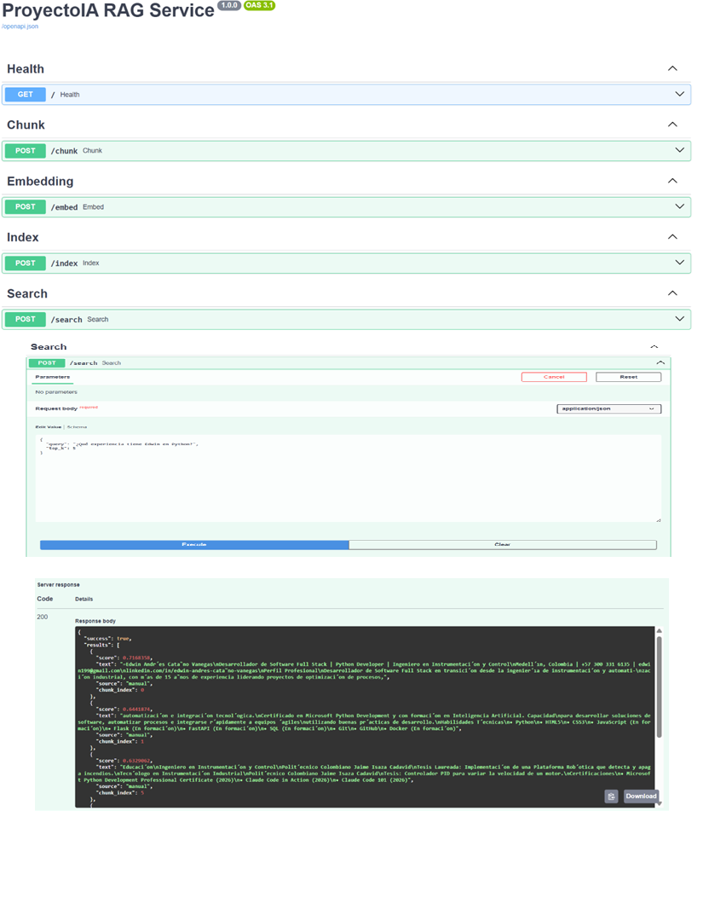
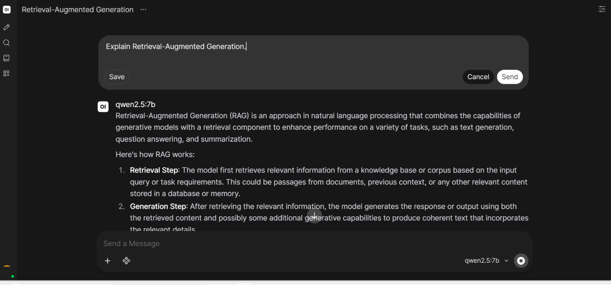

<p align="center">
  
</p>


# 🚀 ProyectoIA

### Enterprise Retrieval-Augmented Generation (RAG) Platform

> **A modular AI platform for document processing, semantic search, and intelligent question answering using FastAPI, Docker, Ollama, Qdrant, and n8n.**


---

## 📖 Overview

ProyectoIA is an end-to-end Retrieval-Augmented Generation (RAG) platform designed to process documents, generate embeddings, perform semantic search, and answer questions using local Large Language Models (LLMs).

The platform follows a modular microservices architecture powered by FastAPI, Docker, Ollama, Qdrant, PostgreSQL, and n8n, making it scalable, maintainable, and easy to extend.

## 🎯 Why ProyectoIA?

Modern AI applications require more than simply calling a Large Language Model.

ProyectoIA demonstrates how to build a production-oriented Retrieval-Augmented Generation (RAG) platform using a modular microservices architecture.

The platform combines:

- Document processing
- Semantic search
- Vector databases
- Local LLMs
- Workflow automation

This architecture is designed to be scalable, maintainable, and easily extensible for real-world AI applications.

## ✨ Features

- 📄 Extract text from PDF documents
- ✂️ Configurable text chunking
- 🧠 Local embedding generation with Ollama
- 🔍 Semantic search using Qdrant
- 🤖 AI-powered question answering
- 🔗 Workflow automation with n8n
- 🐳 Fully containerized using Docker Compose
- ⚡ REST APIs built with FastAPI
- 📚 Interactive API documentation with Swagger/OpenAPI
- 🏗 Modular microservices architecture

---

## 🏗 System Architecture

The platform is built as a collection of independent microservices orchestrated with Docker Compose.



---

## 🔄 RAG Pipeline



---

## 🛠 Technology Stack

| Layer | Technology |
|--------|------------|
| Programming Language | Python 3.12 |
| API Framework | FastAPI |
| Workflow Automation | n8n |
| LLM | Ollama |
| Embeddings | nomic-embed-text |
| Vector Database | Qdrant |
| Relational Database | PostgreSQL |
| Containerization | Docker Compose |
| Validation | Pydantic |
| Documentation | Swagger / OpenAPI |
| Version Control | Git & GitHub |

---

## 📦 Project Structure

```text
ProyectoIA/
│
├── docs/
│   ├── api/
│   ├── architecture/
│   ├── images/
│   ├── setup/
│   └── workflows/
│
├── prompts/
│
├── scripts/
│
├── services/
│   ├── pdf-extractor/
│   └── rag-service/
│
├── tests/
│
├── workflows/
│
├── docker-compose.yml
├── README.md
└── LICENSE
```

---

## 🔧 Microservices

| Service | Responsibility | Port |
|----------|---------------|------|
| PDF Extractor | Extract text from PDF documents | 8000 |
| RAG Service | Chunking, Embeddings, Indexing and Search | 8001 |
| Ollama | Local LLM inference | 11434 |
| Qdrant | Vector Database | 6333 |
| PostgreSQL | n8n persistence | 5432 |
| Open WebUI | LLM Interface | 3000 |
| n8n | Workflow Automation | 5678 |

---

## 🤖 n8n Workflows

| Workflow | Description |
|----------|-------------|
| **01 – Job Offer Analyzer** | Analyze software development job offers using AI |
| **02 – CV Analyzer** | Compare resumes against job descriptions |
| **03 – RAG Indexer** | Extract, chunk and index documents into Qdrant |
| **04 – RAG Chat** | Answer questions using semantic search and local LLMs |

---

## 📡 API Reference

### PDF Extractor

| Method | Endpoint |
|---------|----------|
| GET | `/health` |
| POST | `/extract` |

### RAG Service

| Method | Endpoint |
|---------|----------|
| GET | `/health` |
| POST | `/chunk` |
| POST | `/embed` |
| POST | `/index` |
| POST | `/search` |

---

## 🚀 Getting Started

### Prerequisites

- Docker Desktop
- Git
- Python 3.12 (optional for local development)

### Clone the repository

```bash
git clone https://github.com/<your-username>/ProyectoIA.git
cd ProyectoIA
```

### Configure environment variables

```bash
cp .env.example .env
```

Update the values according to your environment.

### Start all services

```bash
docker compose up -d --build
```

### Available Services

| Service | URL |
|----------|-----|
| n8n | http://localhost:5678 |
| PDF Extractor | http://localhost:8000/docs |
| RAG Service | http://localhost:8001/docs |
| Open WebUI | http://localhost:3000 |
| Qdrant | http://localhost:6333/dashboard |

---

## 🔄 Example Workflow

The following sequence illustrates how ProyectoIA processes a document and answers questions.

```text
PDF Upload

↓

PDF Extractor

↓

Chunking

↓

Embeddings

↓

Qdrant

↓

Semantic Search

↓

Context Builder

↓

LLM (Ollama)

↓

Final Answer
```

Example question:

> What experience does Edwin have with Python?

The RAG Service retrieves the most relevant document fragments from Qdrant and provides them as context to the LLM, which generates a grounded response.

---

## 📸 Screenshots

### 01 — Job Offer Analyzer



---

### 02 — CV Analyzer


---

### 03 — RAG Indexer



---

### 04 — RAG Chat



---

### Swagger Documentation

## 📸 Screenshots

### PDF Extractor API



---

### RAG Service API



---

### System Architecture


---

### n8n Workflows

> Screenshots of the automation workflows are available in `docs/images/`.
---

### RAG Chat


---

## 🏗 System Architecture

<p align="center">

</p>
---

### Open WebUI



---

## 🗺 Roadmap

### Completed

- [x] PDF Extraction Service
- [x] Chunking API
- [x] Embedding API
- [x] Vector Indexing
- [x] Semantic Search
- [x] RAG Chat
- [x] Docker Deployment
- [x] n8n Integration

### In Progress

- [ ] Automated Testing
- [ ] GitHub Actions
- [ ] Logging Improvements

### Planned

- [ ] Hybrid Search
- [ ] Multi-document Retrieval
- [ ] Streaming Responsesworkflow-04-rag-chat
- [ ] Authentication
- [ ] Dashboard

---

## 🚀 Future Improvements

- Hybrid Search
- Metadata Filtering
- Multi-document Support
- CI/CD Pipeline
- Kubernetes Deployment
- Monitoring & Observability
- Performance Metrics
- RAG Evaluation Framework
- Document Versioning

---

## 🤝 Contributing

Contributions are welcome.

If you would like to improve ProyectoIA:

1. Fork the repository.
2. Create a new feature branch.
3. Commit your changes.
4. Open a Pull Request.

Please ensure your code follows the project structure and coding standards.

---

## 📄 License

This project is licensed under the MIT License.

See the LICENSE file for details.

---

## 👨‍💻 Author

**Edwin Andrés Cataño Vanegas**

Software Developer | AI Engineer

- LinkedIn: *(Add your profile)*
- GitHub: https://github.com/edwin199-sudo
