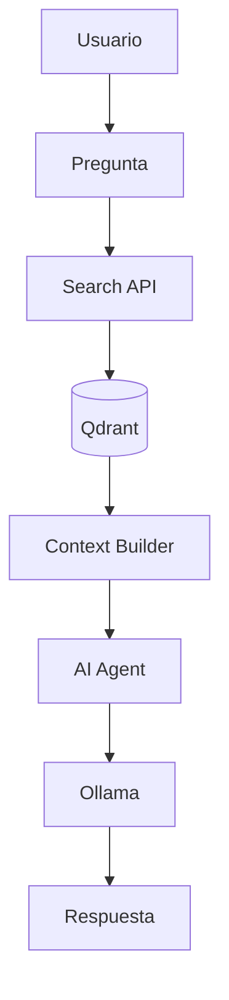

# Flujo de Consulta

```mermaid
flowchart TD

A[Usuario]

B[Pregunta]

C[Search API]

D[(Qdrant)]

E[Context Builder]

F[AI Agent]

G[Ollama]

H[Respuesta]

A --> B

B --> C

C --> D

D --> E

E --> F

F --> G

G --> H
```
