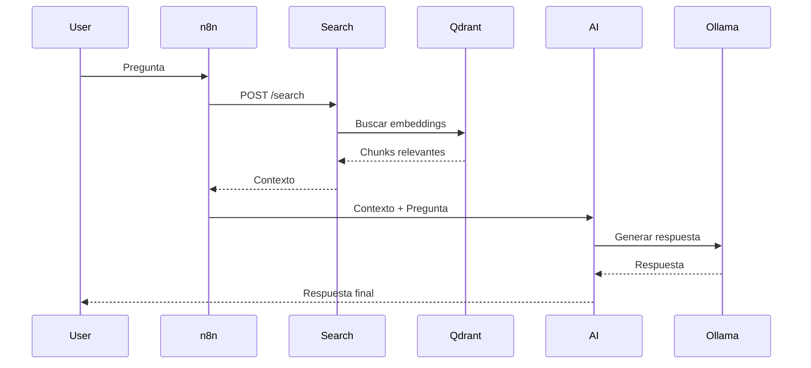

# Secuencia de Consulta

```mermaid
sequenceDiagram

participant User

participant n8n

participant Search

participant Qdrant

participant AI

participant Ollama

User->>n8n: Pregunta

n8n->>Search: POST /search

Search->>Qdrant: Buscar embeddings

Qdrant-->>Search: Chunks relevantes

Search-->>n8n: Contexto

n8n->>AI: Contexto + Pregunta

AI->>Ollama: Generar respuesta

Ollama-->>AI: Respuesta

AI-->>User: Respuesta final
```
